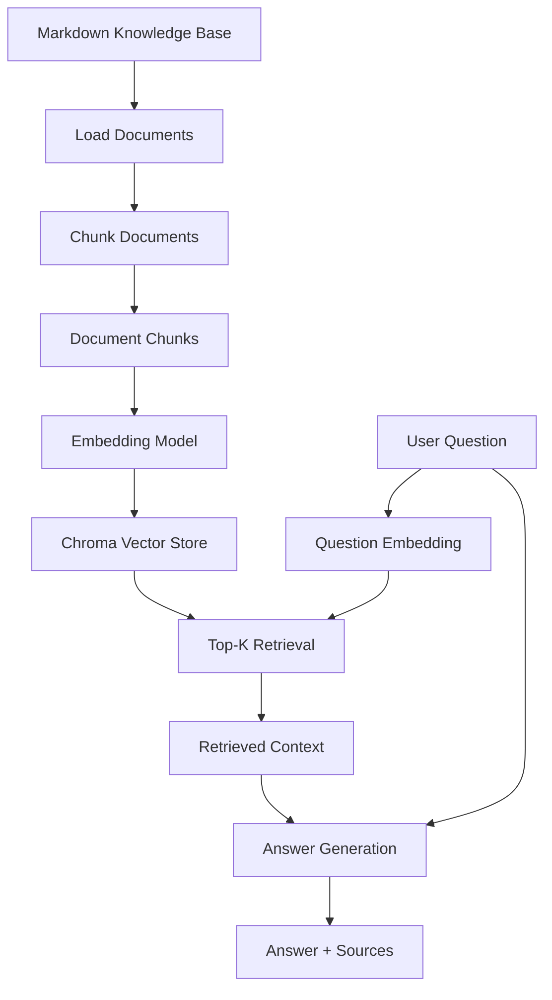

# Architecture：RAG-based AI Pre-sales Knowledge Assistant

## 1. 项目定位

本项目是一个面向 **B2B SaaS 售前场景** 的 RAG 知识库助手。

它的目标是帮助销售、售前工程师和解决方案顾问，从分散的产品文档、价格说明、部署指南、安全文档、API 文档和客户案例中快速检索相关内容，并生成带来源引用的回答。

本项目不是普通聊天机器人，而是一个基于企业知识库的 AI 问答系统。

---

## 2. 整体架构图



---

## 3. 架构流程说明

### Step 1：Markdown Knowledge Base

原始知识库位于：

```text
knowledge_base/
```

其中包含 B2B SaaS 售前资料，例如：

```text
01_product_overview.md
02_faq.md
03_pricing_and_packaging.md
04_deployment_guide.md
05_security_and_governance.md
06_integrations_and_api.md
07_customer_case_studies.md
08_objection_handling.md
09_presales_email_templates.md
```

这些文件是系统回答问题的知识来源。

---

### Step 2：Load Documents

对应文件：

```text
rag_app/load_documents.py
```

作用：

* 读取 `knowledge_base/` 中的 Markdown 文件。
* 保留每个文档的来源信息。
* 把文档加载成程序可以处理的数据结构。

---

### Step 3：Chunk Documents

对应文件：

```text
rag_app/chunk_documents.py
```

作用：

* 把长文档切分成较小的 chunks。
* 为每个 chunk 保存 `chunk_id`、`source_file`、`chunk_index`、`text`。

输出文件：

```text
outputs/document_chunks.json
```

---

### Step 4：Embedding

对应文件：

```text
rag_app/embedding_client.py
```

作用：

* 把 chunk text 转换成 embedding 向量。
* 让系统可以基于语义相似度进行检索。

Embedding 的价值是：

> 用户问题和知识库内容即使关键词不同，只要语义相近，也有机会被匹配到。

例如，用户可能会问：

```text
Can we host the product ourselves?
```

系统应该能够匹配到知识库中的相关表达：

```text
private deployment
```

这说明 embedding 可以帮助系统理解语义相似性，而不是只依赖关键词匹配。

---

### Step 5：Chroma Vector Store

对应文件：

```text
rag_app/build_vector_store.py
```

本地存储位置：

```text
vector_store/
```

作用：

* 保存 chunk embeddings。
* 保存 chunk 来源信息。
* 支持后续 Top-K semantic retrieval。

`vector_store/` 不是普通文档文件夹，而是 Chroma 的本地向量索引存储位置。

---

### Step 6：Retrieval

对应文件：

```text
rag_app/retrieve_context_chroma.py
```

作用：

* 接收用户问题。
* 把问题转换成 embedding。
* 在 Chroma 中检索最相关的 Top-K chunks。
* 返回 retrieved context 和 `source_file`。

---

### Step 7：Answer Generation

对应文件：

```text
rag_app/generate_answer_chroma.py
```

作用：

* 接收 `question`。
* 接收 `retrieved context`。
* 生成 `answer`。
* 返回 `sources`。

当前版本可以使用 Mock LLM 或模板化回答，保证项目在本地可复现。

未来可以替换为：

```text
OpenAI API
Qwen API
DeepSeek API
```

---

## 4. 当前 RAG Pipeline

当前项目的完整 pipeline 可以总结为：

```text
Markdown documents
↓
load_documents.py
↓
chunk_documents.py
↓
outputs/document_chunks.json
↓
embedding_client.py
↓
build_vector_store.py
↓
vector_store/
↓
retrieve_context_chroma.py
↓
generate_answer_chroma.py
↓
answer + sources
```

---

## 5. 为什么这个架构适合 B2B 售前？

B2B SaaS 售前问答有三个特点：

1. 客户问题复杂，涉及产品、价格、部署、安全、API 和案例。
2. 回答必须准确，不能让模型随便编造。
3. 很多问题需要来源依据，尤其是安全、价格、部署和承诺类问题。

因此，本项目使用 RAG 架构：

```text
先检索企业知识库
↓
再基于 retrieved context 生成回答
↓
最后返回 source citation
```

这样可以提升回答的准确性、可追溯性和专业度。

---

## 6. 面试表达

如果面试官问：

> 你的系统是怎么工作的？

我可以这样回答：

> 我的项目是一个面向 B2B SaaS 售前场景的 RAG 知识库助手。
>
> 系统首先读取 `knowledge_base/` 中的 Markdown 售前资料，然后通过 `chunk_documents.py` 把长文档切分成 chunks。每个 chunk 会保留 `chunk_id`、`source_file`、`chunk_index` 和 `text`。
>
> 接着，系统通过 embedding model 把 chunk text 转成向量，并存入 Chroma 本地向量数据库。
>
> 当用户提出问题时，系统会把问题也转成 embedding，在 Chroma 中检索最相关的 Top-K chunks，然后基于 retrieved context 生成回答，并返回 sources。
>
> 这个设计的重点是 source grounding，不是让模型凭空回答，而是让它基于企业知识库中的证据回答。

---

## 7. 一句话总结

本项目通过 RAG 架构，将 B2B SaaS 售前知识库从静态 Markdown 文档转化为可检索、可引用、可解释的 AI 问答系统，核心流程包括文档加载、chunking、embedding、Chroma 向量检索、答案生成和来源引用。
